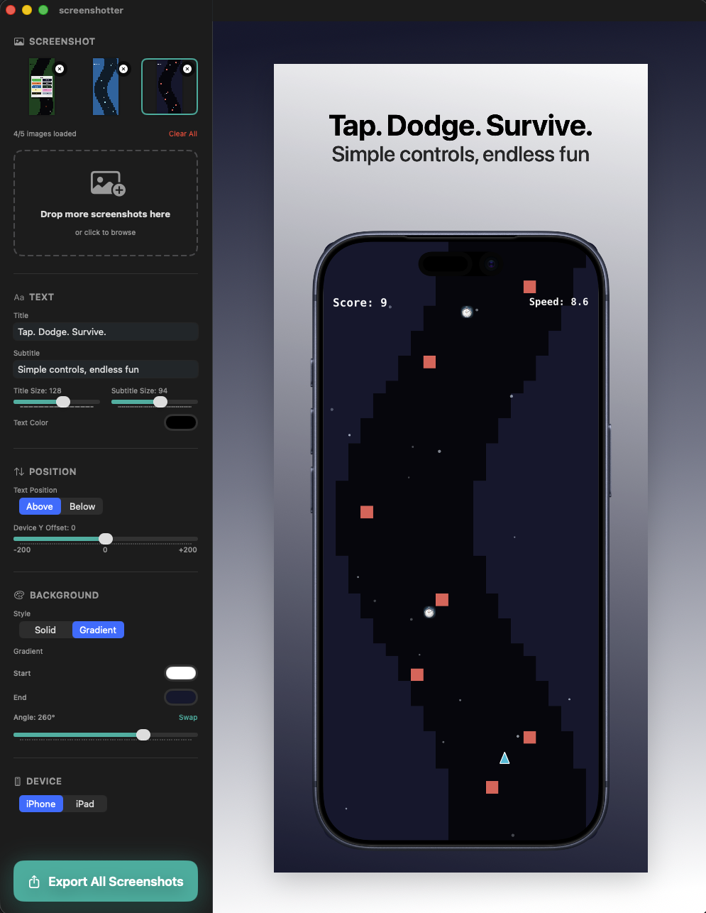

# Screenshotter

A macOS app for creating App Store screenshot mockups. Drop in your screenshots, customize the text and styling, and export ready-to-upload images for the App Store.

Read more about why I built this: [herringtonhq.com/blog/Screenshotter](https://herringtonhq.com/blog/Screenshotter/)



## Features

- **Drag & Drop** - Drop screenshots directly from Finder or iOS Simulator
- **Device Frames** - iPhone and iPad device mockups
- **Customizable Text** - Title and subtitle with adjustable font sizes and colors
- **Background Options** - Solid colors or gradients with angle control
- **Per-Screenshot Settings** - Each screenshot can have its own text, background, and device type
- **Batch Export** - Export all App Store sizes at once
- **JSON Configuration** - Save and load project settings for easy iteration

## Export Sizes

### iPhone (6.5" & 6.9" displays)
- 1284 × 2778 px (Portrait)
- 1242 × 2688 px (Portrait)

### iPad (12.9" & 13" displays)
- 2064 × 2752 px (Portrait)
- 2048 × 2732 px (Portrait)

## Usage

1. **Add Screenshots** - Drag images into the drop zone or use the file picker
2. **Customize** - Adjust text, colors, positioning, and device type for each screenshot
3. **Export** - Click "Export All Screenshots" or press `Cmd+E`

### Keyboard Shortcuts

| Shortcut | Action |
|----------|--------|
| `Cmd+E` | Export all sizes |
| `Cmd+Shift+E` | Export configuration (JSON) |
| `Cmd+Shift+I` | Import configuration (JSON) |

## JSON Configuration

You can export and import project settings as JSON, making it easy to:
- **Edit later** - Save your config alongside your screenshots. When you need to update them for a new app version months later, import the config and your styling is exactly where you left it.
- **Stay consistent** - Share configurations between team members or across multiple apps
- **Iterate quickly** - Tweak the JSON directly for batch changes

Example configuration:
```json
{
  "screenshots": [
    {
      "id": "...",
      "imageName": "screenshot_1.png",
      "settings": {
        "titleText": "Your App Title",
        "subtitleText": "A compelling subtitle",
        "titleFontSize": 128,
        "subtitleFontSize": 94,
        "textPosition": "Above",
        "deviceType": "iPhone",
        "backgroundStyle": "gradient",
        "backgroundGradientAngle": 45
      }
    }
  ]
}
```

## Requirements

- macOS 14.0 or later
- Xcode 15.0 or later (for building)

## Building

1. Clone the repository
2. Open `screenshotter.xcodeproj` in Xcode
3. Select your development team in Signing & Capabilities
4. Build and run (`Cmd+R`)

## License

MIT License - see [LICENSE](LICENSE) for details.
